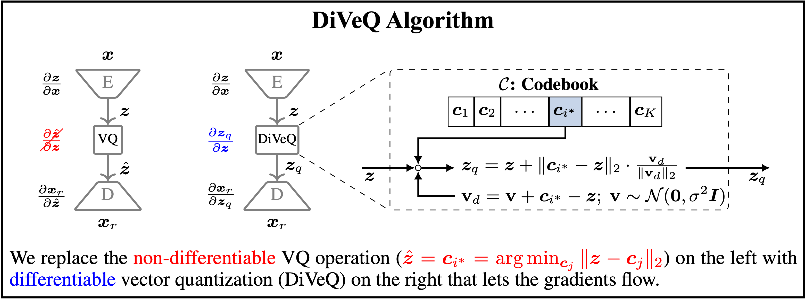

# Welcome to diveq
`diveq` (short for differentiable vector quantization) is a tool for implementing and training vector quantization (VQ) in deep neural networks (DNNs), such as a VQ-VAE. It allows end-to-end training of DNNs that contain the non-differentiable VQ module, without any auxiliary losses and hyperparameter tunings. `diveq` is implemented via PyTorch, and it requires `python >= 3.11` and `torch >= 2.0.0` .



`diveq` method is published as a research paper entitled [*"DiVeQ: Differentiable Vector Quantization Using the Reparameterization Trick"*](https://arxiv.org/pdf/2509.26469) in the International Conference on Learning Representations (ICLR) in 2026. You can find the original GitHub repository of the paper at [https://github.com/AaltoML/DiVeQ](https://github.com/AaltoML/DiVeQ).

`diveq` package includes eight different vector quantization (VQ) methods:
1. `from diveq import DIVEQ` optimizes the VQ codebook via DiVeQ technique. DiVeQ is the first proposed method in the paper that works as an ordinary VQ by mapping the input to codebook vectors.
2. `from diveq import SFDIVEQ` optimizes the VQ codebook via Space-Filling DiVeQ technique. SF-DiVeQ is the second proposed method in the paper, different from ordinary VQ in a way that it maps the input to a space-filling curve constructed from codebook vectors.

VQ variants that use multiple codebooks for vector quantization, i.e., Residual VQ and Product VQ:

3. `from diveq import ResidualDIVEQ` optimizes the Residual VQ codebooks via DiVeQ technique.
4. `from diveq import ResidualSFDIVEQ` optimizes the Residual VQ codebooks via SF-DiVeQ technique.
5. `from diveq import ProductDIVEQ` optimizes the Product VQ codebooks via DiVeQ technique.
6. `from diveq import ProductSFDIVEQ` optimizes the Product VQ codebooks via SF-DiVeQ technique.

Variants of DiVeQ and SF-DiVeQ techniques that use deterministic quantization instead of stochastic quantization:

7. `from diveq import DIVEQDetach` optimizes the VQ codebook via DiVeQ_Detach technique.
8. `from diveq import SFDIVEQDetach` optimizes the VQ codebook via SF-DiVeQ_Detach technique.

For more details on these eight different VQ methods, please see [the paper](https://arxiv.org/pdf/2509.26469).

# Installation

You can install `diveq` through `pip` by running:

```bash
pip install diveq
```

After installing `diveq`, you can verify the installation and package details by running:

```bash
python -m pip show diveq
```

# Usage Example

Before using `diveq`, you have to install it using `pip install diveq`.

Below you see a minimal example of how to import and use the `DIVEQ` optimization method as a vector quantizer in a model.

```bash
from diveq import DIVEQ
vector_quantizer = DIVEQ(num_embeddings, embedding_dim)
```

- `vector_quantizer` is the vector quantization module that will be used for building the model.
- `num_embeddings` and `embedding_dim` are the codebook size and dimension of each codebook entry, respectively. In the following, you can find the list of all parameters used in different vector quantization modules incorporated in `diveq` package.

In the `example` directory, we provide a code example of how vector quantization modules in `diveq` can be used in a vector quantized variational autoencoder (VQ-VAE). You can create the required environment to run the code by running:

```bash
cd example  #change directory to example folder
conda create --name diveq_example python=3.11
conda activate diveq_example
pip install -r requirements.txt
```

Then, you can train the VQ-VAE model by running:

```bash
python train.py
```

# List of Parameters
Here, we provide the list of parameters that are used as inputs to eight different vector quantization methods included in `diveq` package.

- `num_embeddings` (integer): Codebook size or the number of codewords in the codebook.
- `embedding_dim` (integer): Dimensionality of each codebook entry or codeword.
- `noise_var` (float): Variance of the directional noise for stochastic *DiVeQ*- and *SF-DiVeQ*-based methods.
- `replacement_iters` (integer): Number of training iterations to apply codebook replacement.
- `discard_threshold` (float): Threshold to discard the codebook entries that are used less than this threshold after *replacement_iters* iterations.
- `perturb_eps` (float): Adjusts perturbation/shift magnitude from used codewords for codebook replacement.
- `uniform_init` (bool): Whether to use uniform initialization. If False, codebook is initialized from a normal distribution.
- `verbose` (bool): Whether to print codebook replacement status, i.e., to print how many unused codewords are replaced.
- `skip_iters` (integer): Number of training iterations to skip quantization (for *SF-DiVeQ* and *SF-DiVeQ_Detach*) or to use *DiVeQ* quantization (for *Residual_SF-DiVeQ* and *Product_SF-DiVeQ*) in the custom initialization.
- `avg_iters` (integer): Number of recent training iterations to extract latents for custom codebook initialization in Space-Filling Versions.
- `latents_on_cpu` (bool): Whether to collect latents for custom initialization on CPU. If running out of CUDA memory, set it to True.
- `allow_warning` (bool): Whether to print the warnings. The warnings will warn if the user inserts unusual values for the parameters.
- `num_codebooks` (integer): Number of codebooks to be used for quantization in VQ variants of Residual VQ and Product VQ. All the codebooks will have the same size and dimensionality.

# Important Notes about Parameters

1. **Codebook Replacement:** Note that to prevent *codebook collapse*, we include a codebook replacement function (in cases where it is required) inside different quantization modules. Codebook replacement function is called after each `replacement_iters` training iterations, and it replaces the codewords which are used less than `discard_threshold` with perturbation of actively used codewords which are shifted by `perturb_eps` magnitude. If `verbose=True`, the status of how many unused codewords are replaced will be printed by the module. Note that the number of unused codewords should decrease over training, and it might take a while.

2. **Variants of Vector Quantization:** Residual VQ and Product VQ are two variants of vector quantization, which are included in the `diveq` package. These variants utilize multiple codebooks for quantization, where `num_codebooks` determines the number of codebooks used in these VQ variants.

3. **Space-Filling Methods:** Quantization methods based on Space-Filling (i.e., *SF-DiVeQ*, *SF-DiVeQ_Detach*, *Residual_SF-DiVeQ*, *Product_SF-DiVeQ*) use a custom initilization. *SF-DiVeQ* and *SF-DiVeQ_Detach* skip quantizing the latents for `skip_iters` training iterations, and initialize the codebook with an average of latents captured from `avg_iters` recent training iterations. After this custom initialization, they start to quantize the latents. *Residual_SF-DiVeQ* and *Product_SF-DiVeQ* work in the same way, but they apply *DiVeQ* for the first `skip_iters` training iterations. Note that if `avg_iters` value is set to a large value, CUDA might run out of memory, as there should be a large pull of latents to be stored for custom initialization. Therefore, the user can set `latents_on_cpu=True` to store the latents on CPU, or set a smaller value for `avg_iters`.

4. **Detach Methods:** *DiVeQ_Detach* and *SF-DiVeQ_Detach* methods do not use directional noise. Therefore, they do not need to set the `noise_var` parameter.

For further details about different vector quantization methods in the `diveq` package and their corresponding parameters, please see the details provided in the Python codes in `src` directory of the `diveq` package.

# Citation
If this package contributed to your work, please consider citing it:

```
@InProceedings{vali2026diveq,
 title={{DiVeQ}: {D}ifferentiable {V}ector {Q}uantization {U}sing the {R}eparameterization {T}rick},
 author={Vali, Mohammad Hassan and Bäckström, Tom and Solin, Arno},
 booktitle={International Conference on Learning Representations (ICLR)},
 year={2026}
}
```

# License
`diveq` was developed by <span property="cc:attributionName">Mohammad Hassan Vali</span>, part of the <a href="https://users.aalto.fi/~asolin/group/" target="_blank">AaltoML research group from Aalto University</a> and is licensed under MIT license. See the accompanying [LICENSE](LICENSE.txt) file for details.